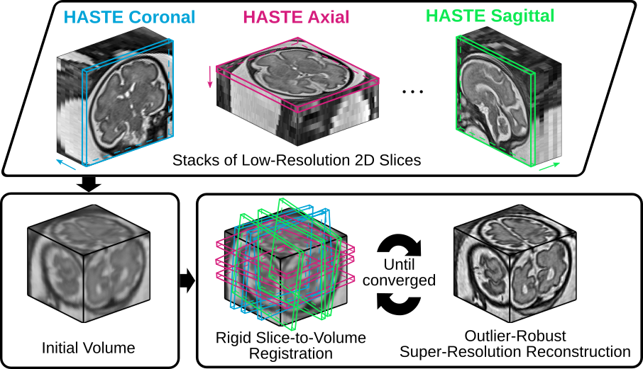
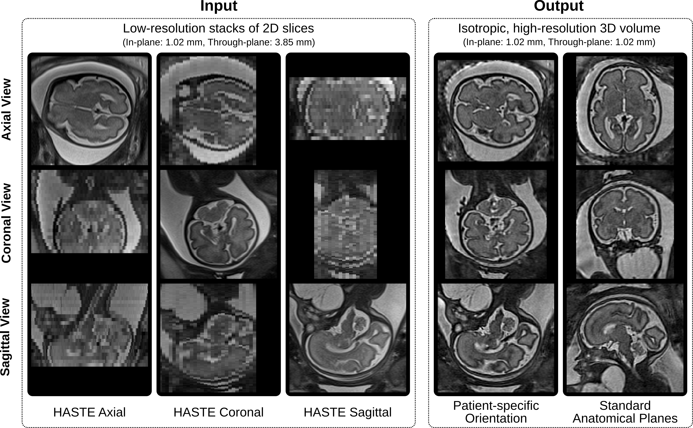

# Motion Correction and Volumetric Image Reconstruction of 2D Ultra-fast MRI

NiftyMIC is a Python-based open-source toolkit for research developed within the [GIFT-Surg][giftsurg] project to reconstruct an isotropic, high-resolution volume from multiple, possibly motion-corrupted, stacks of low-resolution 2D slices. The framework relies on slice-to-volume registration algorithms for motion correction and reconstruction-based Super-Resolution (SR) techniques for the volumetric reconstruction. 

The algorithm and software were developed by [Michael Ebner][mebner] at the [Translational Imaging Group][tig] in the [Centre for Medical Image Computing][cmic] at [University College London (UCL)][ucl].

If you have any questions or comments, please drop an email to `michael.ebner.14@ucl.ac.uk`.

## NiftyMIC applied to fetal brain MRI
Given a set of low-resolution, possibly motion-corrupted, stacks of 2D slices, NiftyMIC produces an isotropic, high-resolution 3D volume. As an example, we illustrate its use for fetal MRI by computing a high-resolution visualization of the brain for a neck mass subject. HASTE sequences were used to acquire the low-resolution images in multiple orientations. The associated brain masks for motion correction were obtained using [fetal_brain_seg][fetal_brain_seg].

<p align="center">
   
</p>
<p align="center">Figure 1. NiftyMIC - a volumetric reconstruction tool based on rigid slice-to-volume registration and outlier-robust super-resolution reconstruction steps - applied to fetal brain MRI.<p align="center">


<p align="center">
   
</p>
<p align="center">Figure 2. Qualitative comparison of the original low-resolution input data and the obtained high-resolution volumetric reconstructions in both the original subject and standard anatomical spaces. Five input stacks (two axial, one coronal and two sagittal stacks) were used. <p align="center">

## Algorithm
Several methods have been implemented to solve the **Robust Super-Resolution Reconstruction (SRR)** problem 
<!-- ```math -->
<!-- \vec{x}^* := \text{argmin}_{\vec{x}\ge 0} \Big[\sum_{k\in\mathcal{K}_\sigma} \sum_{i=1}^{N_k} \varrho\big( (A_k\vec{x} - \vec{y}_k)_i^2 \big) + \alpha\,\text{Reg}(\vec{x}) \Big] -->
<!-- ``` -->
<p align="center">

</p>

<!--to obtain the (vectorized) high-resolution 3D MRI volume $`\vec{x}\in\mathbb{R}^N`$ from multiple, possibly motion corrupted, low-resolution stacks of (vectorized) 2D MR slices $`\vec{y}_k \in\mathbb{R}^{N_k}`$ with $`N_k\ll N`$ for $`k=1,...,\,K`$-->
<!--for a variety of regularizers $`\text{Reg}`$ and data loss functions $`\varrho`$.-->
<!--The linear operator $`A_k := D_k B_k W_k`$ represents the comd operator descri the (rigid) motion $`W_k`$, the blurring operator $`B_k`$ and the downsampling operator $`D_k`$.-->
to obtain the (vectorized) high-resolution 3D MRI volume  from multiple, possibly motion corrupted, low-resolution stacks of (vectorized) 2D MR slices  with  for 
for a variety of regularizers  and data loss functions .
The linear operator  represents the combined operator describing the (rigid) motion , the blurring operator  and the downsampling operator .

The toolkit relies on an iterative motion-correction/reconstruction approach whereby **complete outlier rejection** of misregistered slices is achieved by iteratively solving the SRR problem for a slice-index set 
\ge\sigma\\}\subset&space;\mathcal{K}) containing only slices that are in high agreement with their simulated counterparts projected from a previous high-resolution iterate  according to a similarity measure  and parameter . In the current implementation, the similarity measure  corresponds to Normalized Cross Correlation (NCC).

---

The provided **data loss functions**  are motivated by [SciPy](https://docs.scipy.org/doc/scipy-0.19.0/reference/generated/scipy.optimize.least_squares.html) and allow for robust outlier rejection. Implemented data loss functions are:
<!--$`\varrho(e)=e`$-->
<!--$`\varrho(e)=2(\sqrt{1+e}-1)`$ -->
<!--$`\varrho(e)=|e|_\gamma=\begin{cases}e,&e<\gamma^2\\2\gamma\sqrt{e}-\gamma^2,&e\ge\gamma^2\end{cases}`$-->
<!--$`\varrho(e)=\arctan(e)`$-->
<!--$`\varrho(e)=\ln(1 + e)`$-->
* `linear`: 
* `soft_l1`: 
* `huber`: 
* `arctan`: 
* `cauchy`: 

---

The **available regularizers** include
<!-- * Zeroth-order Tikhonov (TK0): $`\text{Reg}(\vec{x}) = \frac{1}{2}\Vert \vec{x} \Vert_{\ell^2}^2`$ -->
<!-- * First-order Tikhonov (TK1): $`\text{Reg}(\vec{x}) = \frac{1}{2}\Vert \nabla \vec{x} \Vert_{\ell^2}^2`$ -->
<!-- * Isotropic Total Variation (TV): $`\text{Reg}(\vec{x}) = \text{TV}_\text{iso}(\vec{x}) = \big\Vert |\nabla \vec{x}| \big\Vert_{\ell^1}`$ -->
<!-- * Huber Function: $`\text{Reg}(\vec{x}) = \frac{1}{2\gamma} \big| |\nabla \vec{x}| \big|_{\gamma}`$ -->
* Zeroth-order Tikhonov (TK0): 
* First-order Tikhonov (TK1): 
* Isotropic Total Variation (TV): 
* Huber Function: 
---

Additionally, the choice of finding **optimal reconstruction parameters** is facilitated by the [Numerical Solver Library (NSoL)][nsol].

## Disclaimer
NiftyMIC supports medical image registration and volumetric reconstruction for ultra-fast 2D MRI. It has not been tested on larger cohort data yet.
**NiftyMIC is not intended for clinical use**.

## How to cite
If you use this software in your work, please cite

* Ebner, M., Wang, G., Li, W., Aertsen, M., Patel, P. A., Melbourne, A., Doel, T., David, A. L., Deprest, J., Ourselin, S., & Vercauteren, T. (2018). An Automated Localization, Segmentation and Reconstruction Framework for Fetal Brain MRI. In Medical Image Computing and Computer-Assisted Intervention -- MICCAI 2018 (pp. 313–320). Springer.
* Ebner, M., Chung, K. K., Prados, F., Cardoso, M. J., Chard, D. T., Vercauteren, T., & Ourselin, S. (2018). Volumetric reconstruction from printed films: Enabling 30 year longitudinal analysis in MR neuroimaging. NeuroImage, 165, 238–250.


## Installation

NiftyMIC was developed in Ubuntu 16.04 and Mac OS X 10.12 and tested for Python 2.7.12 and 3.5.2.

It builds on a couple of additional libraries developed within the [GIFT-Surg][giftsurg] project including 
* [NSoL][nsol]
* [SimpleReg][simplereg]
* [PySiTK][pysitk]
* [ITK_NiftyMIC][itkniftymic]

whose installation requirements need to be met. Therefore, the installation comes in three steps:

1. [Installation of ITK_NiftyMIC][itkniftymic]
1. [Installation of SimpleReg dependencies][simplereg-dependencies]
1. [Installation of NiftyMIC][niftymic-install]


## Usage

Provided the input MR image data in NIfTI format (`nii` or `nii.gz`), NiftyMIC can reconstruct an isotropic, high-resolution volume from multiple, possibly motion-corrupted, stacks of low-resolution 2D slices.

A recommended workflow is [associated applications in square brackets]

1. Bias-field correction [`niftymic_correct_bias_field`]
1. Volumetric reconstruction in subject space using two-step iterative approach based on rigid slice-to-volume registration and SRR cycles [`niftymic_reconstruct_volume`]

In case reconstruction in a template space is desired (like for fetal MRI) additional steps could be:
1. Register obtained SRR to template and update respective slice motion corrections [`niftymic_register_image`]
1. Volumetric reconstruction in template space [`niftymic_reconstruct_volume_from_slices`]

Additional information on how to use NiftyMIC and its applications is provided in the following.

### Volumetric MR Reconstruction from Motion Corrupted 2D Slices
Leveraging a two-step registration-reconstruction approach an isotropic, high-resolution 3D volume can be generated from multiple stacks of low-resolution slices.

An example for a basic usage reads
```
niftymic_reconstruct_volume \
--filenames path-to-stack1.nii.gz ... path-to-stackN.nii.gz \
--dir-output output-dir \
--suffix-mask _mask
```
whereby complete outlier removal during SRR is activated by default (`--outlier-rejection 1`).

A more elaborate example could be
```
niftymic_reconstruct_volume \
--filenames path-to-stack1.nii.gz ... path-to-stackN.nii.gz \
--suffix-mask _mask \
--alpha 0.01 \
--outlier-rejection 1 \
--threshold-first 0.6 \
--threshold 0.8 \
--intensity-correction 1 \
--isotropic-resolution 0.8 \
--two-step-cycles 3 \
--dir-output output-dir \
--subfolder-motion-correction motion_correction \ # created in 'output-dir'
--verbose 1
```

The obtained motion-correction transformations in `motion_correction` can be used for further processing, e.g. by using `niftymic_reconstruct_volume_from_slices.py` to solve the SRR problem for a variety of different regularization and data loss function types. 

### Transformation to Template Space
If a template is available, it is possible to obtain a SRR in its associated standard anatomical space. Using the subject-space SRR outcome of `niftymic_reconstruct_volume` a rigid alignment step maps all slice motion correction transformations accordingly using
```
niftymic_register_image \
--fixed path-to-template.nii.gz \
--moving path-to-subject-space-srr.nii.gz \
--dir-input-mc dir-to-motion_correction \
--dir-output output-dir
```


### SRR Methods for Motion Corrected (or Static) Data

After performed/updated motion correction (or having static data in the first place) several options are available:

* Volumetric reconstruction in template space
* Parameter tuning for SRR:
    * different solvers and regularizers can be used to solve the SRR problem for comparison
    * parameter studies can be performed to find optimal reconstruction parameters.

#### SRR from Motion Corrected (or Static) Slice Acquisitions

Solve the SRR problem for motion corrected data (or static data if `--dir-input-mc` is omitted):
```
niftymic_reconstruct_volume_from_slices \
--filenames path-to-stack1.nii.gz ... path-to-stackN.nii.gz \
--dir-input-mc dir-to-motion_correction \ # optional
--dir-output output-dir \
--reconstruction-type TK1L2 \
--reconstruction-space path-to-template.nii.gz \ # optional
--alpha 0.01
```
```
niftymic_reconstruct_volume_from_slices \
--filenames path-to-stack1.nii.gz ... path-to-stackN.nii.gz \
--dir-input-mc dir-to-motion_correction \
--dir-output output-dir \
--reconstruction-type HuberL2 \
--alpha 0.003
```

Slices that were rejected during the `niftymic_reconstruct_volume` run are recognized as outliers based on the content of `dir-input-mc` and will not be incorporated during the volumetric reconstruction.


#### Parameter Studies to Determine Optimal SRR Parameters
The optimal choice for reconstruction parameters like the regularization parameter or data loss function can be found by running parameter studies. This includes L-curve studies and direct comparison against a reference volume for various cost functions.

Example are:
```
niftymic_run_reconstruction_parameter_study \
--filenames path-to-stack1.nii.gz ... path-to-stackN.nii.gz \
--dir-input-mc dir-to-motion_correction \
--dir-output dir-to-param-study-output \
--reconstruction-type HuberL2 \
--reference path-to-reference-volume.nii.gz \
--reference-mask path-to-reference-volume_mask.nii.gz \
--measures RMSE PSNR NCC NMI SSIM \
--alpha-range 0.001 0.003 10
```
```
niftymic_run_reconstruction_parameter_study \
--filenames path-to-stack1.nii.gz ... path-to-stackN.nii.gz \
--dir-input-mc dir-to-motion_correction \
--dir-output dir-to-param-study-output \
--reconstruction-type TVL2 \
--reference path-to-reference-volume.nii.gz \
--reference-mask path-to-reference-volume_mask.nii.gz \
--measures RMSE PSNR NCC NMI SSIM \
--alpha-range 0.001 0.003 10
```
```
niftymic_run_reconstruction_parameter_study \
--filenames path-to-stack1.nii.gz ... path-to-stackN.nii.gz \
--dir-input-mc dir-to-motion_correction \
--dir-output dir-to-param-study-output \
--reconstruction-type TK1L2 \
--reference path-to-reference-volume.nii.gz \
--reference-mask path-to-reference-volume_mask.nii.gz \
--measures RMSE PSNR NCC NMI SSIM \
--alpha-range 0.001 0.05 20
```

The results can be assessed by accessing the [NSoL][nsol]-script `show_parameter_study.py` via
```
niftymic_show_parameter_study \
--dir-input dir-to-param-study-output \
--study-name TK1L2 \
--dir-output-figures dir-to-figures
```

## Licensing and Copyright
Copyright (c) 2018, [University College London][ucl].
This framework is made available as free open-source software under the [BSD-3-Clause License][bsd]. Other licenses may apply for dependencies.


## Funding
This work is partially funded by the UCL [Engineering and Physical Sciences Research Council (EPSRC)][epsrc] Centre for Doctoral Training in Medical Imaging (EP/L016478/1), the Innovative Engineering for Health award ([Wellcome Trust][wellcometrust] [WT101957] and [EPSRC][epsrc] [NS/A000027/1]), and supported by researchers at the [National Institute for Health Research][nihr] [University College London Hospitals (UCLH)][uclh] Biomedical Research Centre.

## References
Associated publications are 
* [[EbnerWang2018]](http://link.springer.com/10.1007/978-3-030-00928-1_36) Ebner, M., Wang, G., Li, W., Aertsen, M., Patel, P. A., Melbourne, A., Doel, T., David, A. L., Deprest, J., Ourselin, S., & Vercauteren, T. (2018). An Automated Localization, Segmentation and Reconstruction Framework for Fetal Brain MRI. In Medical Image Computing and Computer-Assisted Intervention -- MICCAI 2018 (pp. 313–320). Springer
* [[Ebner2018]](https://www.sciencedirect.com/science/article/pii/S1053811917308042) Ebner, M., Chung, K. K., Prados, F., Cardoso, M. J., Chard, D. T., Vercauteren, T., & Ourselin, S. (2018). Volumetric reconstruction from printed films: Enabling 30 year longitudinal analysis in MR neuroimaging. NeuroImage, 165, 238–250.
* [[Ranzini2017]](https://mski2017.files.wordpress.com/2017/09/miccai-mski2017.pdf) Ranzini, M. B., Ebner, M., Cardoso, M. J., Fotiadou, A., Vercauteren, T., Henckel, J., Hart, A., Ourselin, S., and Modat, M. (2017). Joint Multimodal Segmentation of Clinical CT and MR from Hip Arthroplasty Patients. MICCAI Workshop on Computational Methods and Clinical Applications in Musculoskeletal Imaging (MSKI) 2017.
* [[Ebner2017]](https://link.springer.com/chapter/10.1007%2F978-3-319-52280-7_1) Ebner, M., Chouhan, M., Patel, P. A., Atkinson, D., Amin, Z., Read, S., Punwani, S., Taylor, S., Vercauteren, T., and Ourselin, S. (2017). Point-Spread-Function-Aware Slice-to-Volume Registration: Application to Upper Abdominal MRI Super-Resolution. In Zuluaga, M. A., Bhatia, K., Kainz, B., Moghari, M. H., and Pace, D. F., editors, Reconstruction, Segmentation, and Analysis of Medical Images. RAMBO 2016, volume 10129 of Lecture Notes in Computer Science, pages 3–13. Springer International Publishing.


[mebner]: http://cmictig.cs.ucl.ac.uk/people/phd-students/michael-ebner
[tig]: http://cmictig.cs.ucl.ac.uk
[bsd]: https://opensource.org/licenses/BSD-3-Clause
[giftsurg]: http://www.gift-surg.ac.uk
[cmic]: http://cmic.cs.ucl.ac.uk
[guarantors]: https://guarantorsofbrain.org/
[ucl]: http://www.ucl.ac.uk
[uclh]: http://www.uclh.nhs.uk
[epsrc]: http://www.epsrc.ac.uk
[wellcometrust]: http://www.wellcome.ac.uk
[mssociety]: https://www.mssociety.org.uk/
[nihr]: http://www.nihr.ac.uk/research
[itkniftymic]: https://github.com/gift-surg/ITK_NiftyMIC/wikis/home
[niftymic-install]: https://github.com/gift-surg/NiftyMIC/wikis/niftymic-installation
[nsol]: https://github.com/gift-surg/NSoL
[simplereg]: https://github.com/gift-surg/SimpleReg
[simplereg-dependencies]: https://github.com/gift-surg/SimpleReg/wikis/simplereg-dependencies
[pysitk]: https://github.com/gift-surg/PySiTK
[fetal_brain_seg]: https://github.com/gift-surg/fetal_brain_seg
